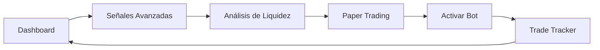

# 🚀 Sistema de Trading Profesional v3.0
## Con Análisis de Estructura de Mercado y Pools de Liquidez

---

## ✅ **CONFIRMACIÓN: TODO ESTÁ INTEGRADO EN UN SOLO FRONTEND**

La interfaz `interfaz_completa.py` unifica TODOS los módulos del sistema en una sola aplicación web.

---

## 📦 Instalación Rápida

```bash
# 1. Activar entorno virtual
source venv/bin/activate

# 2. Instalar dependencias (si falta alguna)
pip install streamlit yfinance pandas plotly requests

# 3. Ejecutar la interfaz completa
python3 -m streamlit run interfaz_completa.py
```

---

## 🎯 Módulos Integrados en la Interfaz

### 1. **📊 Dashboard Principal**
- Vista general del mercado en tiempo real
- Análisis técnico con indicadores (SMA, RSI, ATR)
- Top movers de Binance
- Gráficos interactivos con velas japonesas

### 2. **🎯 Señales Avanzadas** (NUEVO)
- Detección basada en estructura de mercado real
- Identificación de soportes y resistencias
- Niveles de Fibonacci automáticos
- Patrones gráficos (Double Top/Bottom, Flags)
- Order blocks institucionales

### 3. **💧 Pools de Liquidez** (NUEVO)
- Mapa de calor de zonas de liquidación
- Detección de clusters de stop loss
- Cálculo de niveles por leverage (3x, 5x, 10x, etc.)
- Sugerencias de entrada/salida basadas en liquidez

### 4. **📈 Paper Trading**
- Backtesting con datos históricos
- Simulación con leverage configurable
- Métricas de performance detalladas
- Análisis de resultados

### 5. **🤖 Live Bot Monitor**
- Estado del bot en tiempo real
- Últimas señales enviadas
- Estadísticas de sesión
- Control del bot desde la interfaz

### 6. **📋 Trade Tracker** (NUEVO)
- Seguimiento automático de todos los trades
- Métricas en tiempo real (Win Rate, PnL, etc.)
- Historial completo con exportación CSV/JSON
- Análisis de performance por activo

### 7. **⚙️ Configuración**
- Gestión de canales de notificación (Telegram)
- Filtros de señales (score mínimo, cooldown)
- Parámetros del sistema

---

## 🔄 Flujo de Trabajo Recomendado



1. **Revisar Dashboard** → Estado general del mercado
2. **Buscar Señales Avanzadas** → Oportunidades basadas en estructura
3. **Analizar Liquidez** → Verificar riesgo de barridos
4. **Paper Trading** → Probar estrategia primero
5. **Activar Bot** → Trading automático
6. **Monitorear Trades** → Seguimiento de resultados

---

## 🤖 Bot de Trading Avanzado

Para ejecutar el bot automático con todas las funcionalidades:

```bash
# Bot con análisis de liquidez integrado
python3 signal_bot_advanced.py

# O con intervalo personalizado (minutos)
python3 signal_bot_advanced.py 10
```

### Características del Bot:
- ✅ Escanea 15 criptomonedas principales
- ✅ Detecta señales con estructura de mercado
- ✅ Considera pools de liquidez
- ✅ Envía señales a Telegram automáticamente
- ✅ Registra todos los trades para análisis

---

## 📱 Navegación en la Interfaz

1. **Sidebar Izquierdo**: Menú principal con todos los módulos
2. **Estado del Mercado**: Semáforo siempre visible (🟢🟡🔴)
3. **Tabs y Expandibles**: Organización clara de la información
4. **Métricas en Tiempo Real**: Actualización automática

---

## 🎨 Características de Diseño

- **Tema Oscuro**: Estilo Binance profesional
- **Colores Significativos**: 
  - 🟢 Verde = Alcista/Compra
  - 🔴 Rojo = Bajista/Venta
  - 🟡 Amarillo = Neutral/Precaución
  - 💧 Azul = Pools de liquidez
- **Responsive**: Se adapta a diferentes tamaños de pantalla
- **Gráficos Interactivos**: Zoom, pan, hover para detalles

---

## 📊 Datos y Archivos

El sistema genera y utiliza estos archivos:

```
saby/
├── signal_config.json          # Configuración principal
├── trades_history.json         # Historial de trades
├── trades_history.csv          # Exportación para análisis
├── signals_YYYYMMDD.json       # Señales del día
├── liquidity_analysis.json     # Último análisis de liquidez
└── advanced_signals.json       # Señales avanzadas guardadas
```

---

## 🔧 Configuración de Telegram

Para recibir señales en Telegram:

1. Crear bot con @BotFather
2. Obtener token del bot
3. Obtener tu chat ID
4. Configurar en la interfaz (sección ⚙️ Configuración)

---

## 📈 Ventajas del Sistema Integrado

1. **Un Solo Punto de Acceso**: Todo en `interfaz_completa.py`
2. **Análisis Completo**: Técnico + Estructura + Liquidez
3. **Automatización**: Bot con todas las funcionalidades
4. **Tracking Completo**: Cada trade es registrado
5. **Sin Cambio de Contexto**: Todo en la misma interfaz
6. **Datos Persistentes**: Historial y configuración guardados

---

## 🚨 Comandos Importantes

```bash
# Ver estado del sistema
python3 verificar_integracion.py

# Probar pools de liquidez
python3 liquidity_pools.py

# Ejecutar señales avanzadas manualmente
python3 advanced_signals.py

# Verificar configuración
cat signal_config.json
```

---

## 💡 Tips de Uso

1. **Mercado Amarillo**: El bot no opera, espera mejores condiciones
2. **Score Mínimo 6**: Solo señales de calidad media-alta
3. **Cooldown 60 min**: Evita sobre-trading del mismo activo
4. **Leverage 3x**: Por defecto, ajustable en Paper Trading
5. **Pools de Liquidez**: Evita poner stops donde hay clusters

---

## ✅ Verificación de Integración

Ejecuta este comando para verificar que todo está instalado:

```bash
python3 verificar_integracion.py
```

Deberías ver:
- ✅ Todos los módulos encontrados
- ✅ Configuración cargada
- ✅ Sistema completamente integrado

---

## 📞 Soporte

Si encuentras algún problema:

1. Verifica el entorno virtual: `source venv/bin/activate`
2. Reinstala dependencias: `pip install -r requirements.txt`
3. Revisa logs en la terminal
4. Verifica configuración en `signal_config.json`

---

**¡El sistema está listo para producción! 🚀**