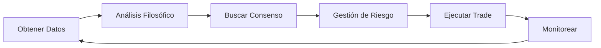

# 📊 GUÍA COMPLETA DE DAILY TRADING

## 🎯 Cómo Funciona el Sistema Integrado

### 🏗️ Arquitectura del Sistema

```
┌─────────────────────────────────────────────────────────┐
│                    DAILY TRADING MANAGER                 │
├─────────────────────────────────────────────────────────┤
│                                                           │
│  ┌──────────────┐  ┌──────────────┐  ┌──────────────┐  │
│  │   BINANCE    │  │  10 FILÓSOFOS │  │   FASTAPI    │  │
│  │     API      │  │    TRADERS    │  │   MONITOR    │  │
│  └──────────────┘  └──────────────┘  └──────────────┘  │
│         ↓                  ↓                  ↓          │
│  ┌────────────────────────────────────────────────┐     │
│  │           MULTI-PROJECT MANAGER                 │     │
│  ├────────────────────────────────────────────────┤     │
│  │ • Conservador (30%)  • Balanceado (40%)        │     │
│  │ • Agresivo (20%)     • Adaptativo (10%)        │     │
│  └────────────────────────────────────────────────┘     │
│                                                           │
└─────────────────────────────────────────────────────────┘
```

## 🌅 RUTINA DIARIA

### 1. **SETUP MATUTINO (9:00 AM)**

```python
# El sistema automáticamente:
1. Revisa balance en Binance
2. Identifica posiciones abiertas
3. Crea 4 proyectos del día
4. Hace análisis inicial del mercado
```

#### Distribución de Capital ($1000)
- **Proyecto Conservador**: $300 (30%)
  - Filósofos: Sócrates, Confucio, Kant
  - Riesgo: 0.5% por trade
  - Símbolos: BTC, ETH

- **Proyecto Balanceado**: $400 (40%)
  - Filósofos: Platón, Descartes, Aristóteles
  - Riesgo: 1% por trade
  - Símbolos: BTC, ETH, SOL

- **Proyecto Agresivo**: $200 (20%)
  - Filósofos: Nietzsche, Sun Tzu, Maquiavelo
  - Riesgo: 2% por trade
  - Símbolos: SOL, DOGE

- **Proyecto Adaptativo**: $100 (10%)
  - Filósofo: Heráclito
  - Riesgo: 1.5% por trade
  - Símbolo: BTC

### 2. **CICLO DE TRADING (Cada Hora)**



#### Proceso Detallado:

**HORA 1: Obtención de Datos**
```python
# Binance API obtiene:
- BTC/USDT: 1h, 4h, 1d
- ETH/USDT: 1h, 4h, 1d  
- SOL/USDT: 1h, 4h, 1d
```

**HORA 2: Análisis Filosófico**
```
Sócrates analiza BTC → "Precio en soporte, RSI oversold"
Platón analiza BTC → "Patrón Fibonacci perfecto en 0.618"
→ CONSENSO: COMPRA BTC
```

**HORA 3: Validación de Riesgo**
```
✓ Posiciones abiertas: 1/3
✓ Exposición BTC: 0
✓ Riesgo del trade: $10 (1%)
✓ Stop loss: -3%
→ APROBADO
```

**HORA 4: Ejecución**
```
ORDEN: BUY 0.0001 BTC @ $117,500
Stop Loss: $114,000
Take Profit: $121,000
```

### 3. **MONITOREO CONTINUO**

El sistema revisa automáticamente:
- ⏰ **Cada 5 minutos**: Precios actuales
- 🛑 **Stop Loss**: Cierre automático si -3%
- 🎯 **Take Profit**: Cierre automático si +5%
- ⚠️ **Pérdida Diaria**: Stop si -5% del capital

## 📊 EJEMPLO DE DÍA REAL

### Mañana (9:00 AM)
```
Balance: $1000 USDT
BTC: $117,500
ETH: $4,450
SOL: $192
```

### 10:00 AM - Primera Señal
```
CONSENSO DETECTADO:
- Sócrates: "BTC en soporte"
- Confucio: "Retorno al equilibrio"
→ BUY 0.0001 BTC @ $117,500
```

### 12:00 PM - Segunda Señal
```
CONSENSO DETECTADO:
- Nietzsche: "Pánico en SOL, contrarian"
- Sun Tzu: "Enemigo exhausto"
→ BUY 1 SOL @ $190
```

### 3:00 PM - Take Profit
```
BTC alcanza $119,500
→ VENTA automática
Ganancia: +$20 (2%)
```

### 6:00 PM - Stop Loss
```
SOL cae a $184
→ VENTA automática
Pérdida: -$6 (3%)
```

### Fin del Día (11:00 PM)
```
Trades: 2
Ganadores: 1
Perdedores: 1
P&L Neto: +$14
ROI: +1.4%
```

## 🎯 REGLAS DE ORO

### ✅ SIEMPRE:
1. **Esperar consenso** (mínimo 2 filósofos)
2. **Respetar stops** (sin excepciones)
3. **Limitar riesgo** (1% por trade)
4. **Diversificar** (máx 3 posiciones)
5. **Registrar todo** (para análisis)

### ❌ NUNCA:
1. **Operar sin consenso**
2. **Mover stops en pérdida**
3. **Revenge trading**
4. **Exceder límite diario** (-5%)
5. **Ignorar señales de cierre**

## 💡 TIPS AVANZADOS

### Mejores Combinaciones de Filósofos

**Para Mercado Lateral (Ranging)**
- Sócrates + Confucio = Mean Reversion
- Alta efectividad en consolidaciones

**Para Tendencias Fuertes**
- Aristóteles + Sun Tzu = Trend Following
- Captura grandes movimientos

**Para Volatilidad Alta**
- Nietzsche + Heráclito = Contrarian Adaptativo
- Aprovecha pánicos y euforias

**Para Confirmación Máxima**
- Descartes + Kant + Platón = Triple Validación
- Pocas señales pero muy precisas

## 📈 MÉTRICAS DE ÉXITO

### KPIs Diarios
- **Win Rate objetivo**: >55%
- **Risk/Reward mínimo**: 1:2
- **Máximo drawdown diario**: -5%
- **ROI objetivo diario**: +1-2%

### KPIs Mensuales
- **Días positivos**: >60%
- **ROI mensual objetivo**: +15-30%
- **Sharpe Ratio**: >1.5
- **Máximo drawdown**: -10%

## 🚀 COMANDOS RÁPIDOS

### Iniciar Trading del Día
```python
manager = DailyTradingManager(capital=1000, testnet=False)
manager.morning_setup()
await manager.trading_cycle()
```

### Monitorear Estado
```bash
curl http://localhost:8000/api/v1/status
```

### Cerrar Todas las Posiciones
```python
manager.close_all_positions()
manager.end_of_day_report()
```

## 🔧 CONFIGURACIÓN RECOMENDADA

### Para Capital Pequeño ($200-500)
```python
config = {
    'max_positions': 1,
    'risk_per_trade': 0.005,  # 0.5%
    'symbols': ['SOL/USDT', 'DOGE/USDT'],
    'philosophers': ['SOCRATES', 'CONFUCIO']
}
```

### Para Capital Medio ($500-2000)
```python
config = {
    'max_positions': 2,
    'risk_per_trade': 0.01,  # 1%
    'symbols': ['BTC/USDT', 'ETH/USDT', 'SOL/USDT'],
    'philosophers': ['SOCRATES', 'ARISTOTELES', 'PLATON', 'KANT']
}
```

### Para Capital Grande ($2000+)
```python
config = {
    'max_positions': 3,
    'risk_per_trade': 0.015,  # 1.5%
    'symbols': ['BTC/USDT', 'ETH/USDT', 'SOL/USDT', 'AVAX/USDT'],
    'philosophers': 'ALL'  # Todos los 10 filósofos
}
```

## 📱 NOTIFICACIONES

El sistema puede enviar alertas por:
- 📧 Email
- 💬 Telegram
- 🔔 Discord
- 📲 SMS (Twilio)

Configurar en `.env`:
```env
TELEGRAM_BOT_TOKEN=xxx
TELEGRAM_CHAT_ID=xxx
DISCORD_WEBHOOK=xxx
EMAIL_SMTP=xxx
```

## 🎓 FILOSOFÍA DEL SISTEMA

> "El mercado es un océano de posibilidades donde cada filósofo ve una verdad diferente. 
> El consenso entre múltiples perspectivas nos acerca a la verdad objetiva."

### Por qué Funciona:
1. **Diversidad cognitiva**: Cada filósofo tiene sesgos diferentes
2. **Validación cruzada**: El consenso filtra señales falsas
3. **Adaptación dinámica**: Diferentes filosofías para diferentes mercados
4. **Gestión de riesgo**: Límites estrictos protegen el capital
5. **Disciplina sistemática**: Las reglas se ejecutan sin emoción

## 🏆 RESULTADOS ESPERADOS

### Mes 1 (Aprendizaje)
- ROI: -5% a +5%
- Objetivo: Entender el sistema

### Mes 2-3 (Optimización)
- ROI: +5% a +15%
- Objetivo: Afinar parámetros

### Mes 4+ (Producción)
- ROI: +15% a +30%
- Objetivo: Escalar capital

## 🆘 TROUBLESHOOTING

### "No hay señales"
- Mercado sin condiciones claras
- Esperar, no forzar trades

### "Muchos stops"
- Reducir tamaño de posición
- Ampliar stop loss a 4-5%

### "API timeout"
- Verificar conexión internet
- Cambiar a servidor más cercano

### "Consenso raro"
- Normal en mercados complejos
- Confiar en el proceso

## 📚 RECURSOS ADICIONALES

- [Documentación Binance API](https://binance-docs.github.io/apidocs/)
- [Filosofías de Trading](./philosophers.py)
- [Backtesting Manual](./backtest_guide.md)
- [Risk Management](./risk_management.md)

---

💎 **Recuerda**: El éxito en trading no viene de una estrategia perfecta, 
sino de la disciplina perfecta ejecutando una buena estrategia.

🚀 **Happy Trading!**